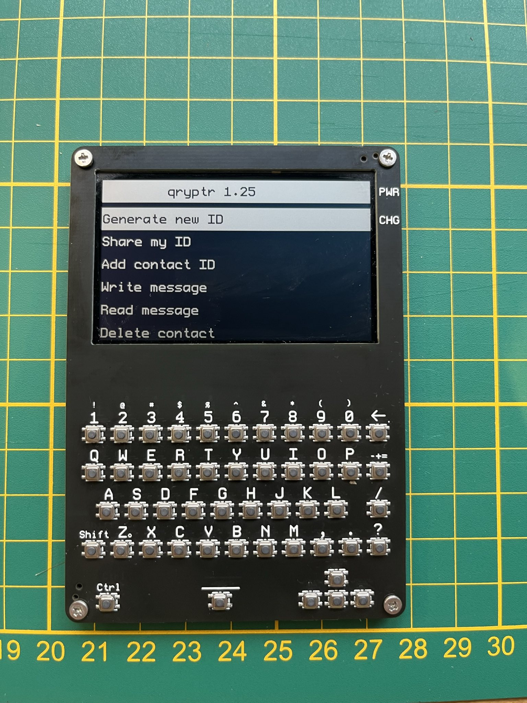
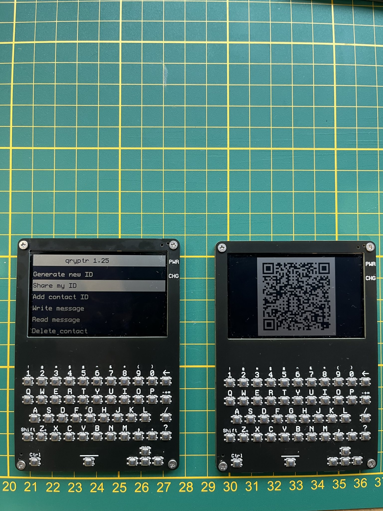
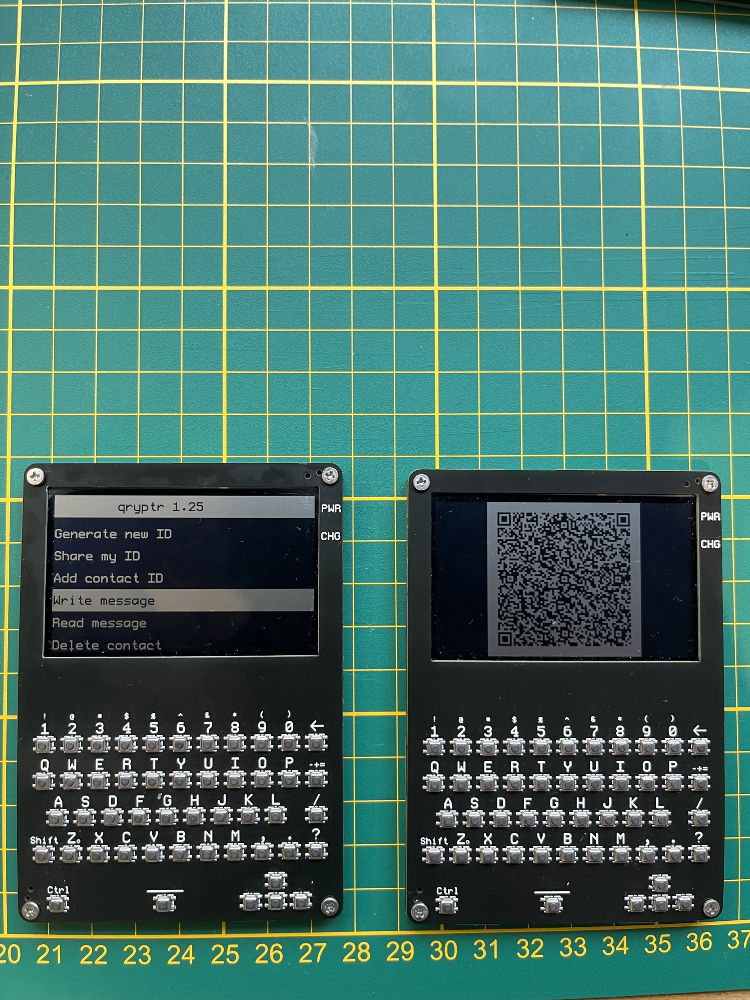
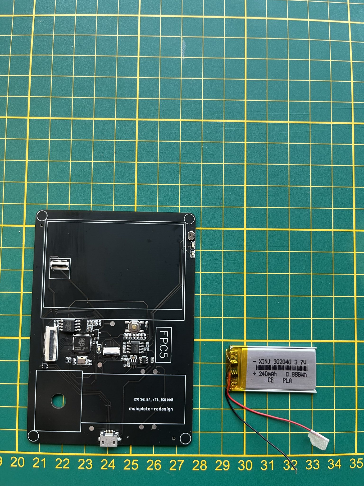
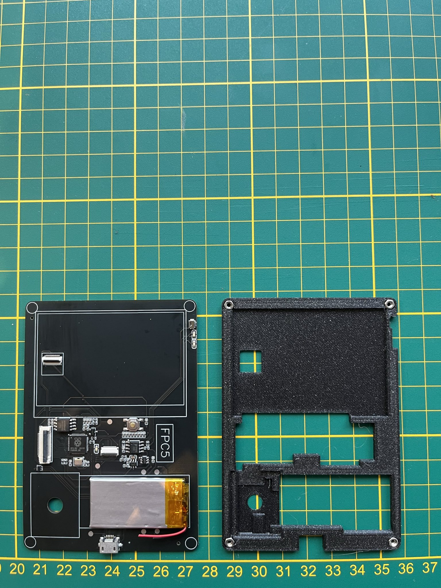
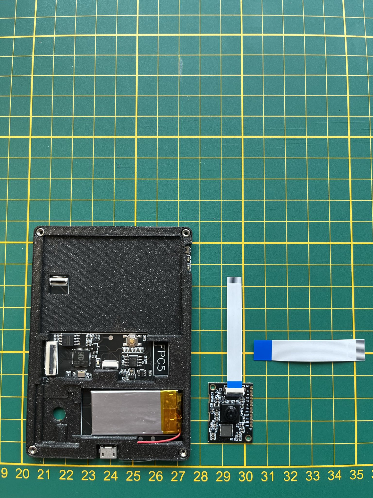
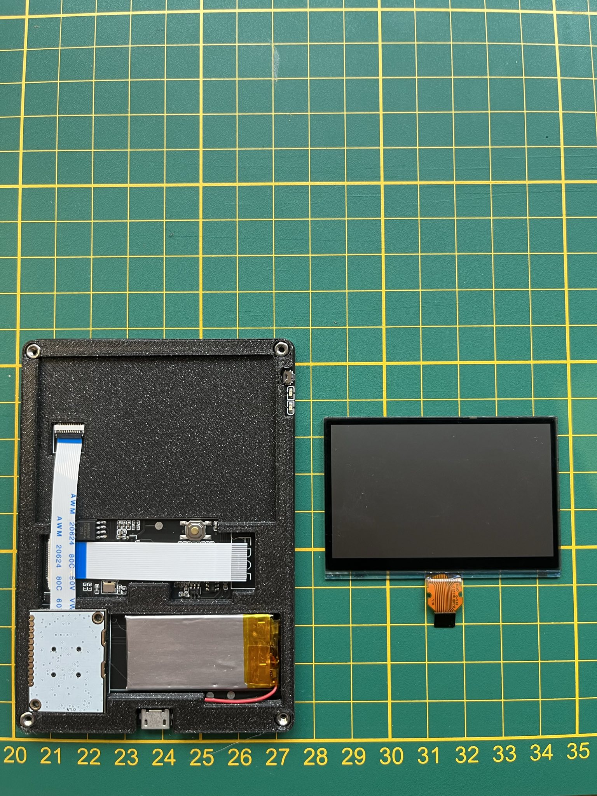
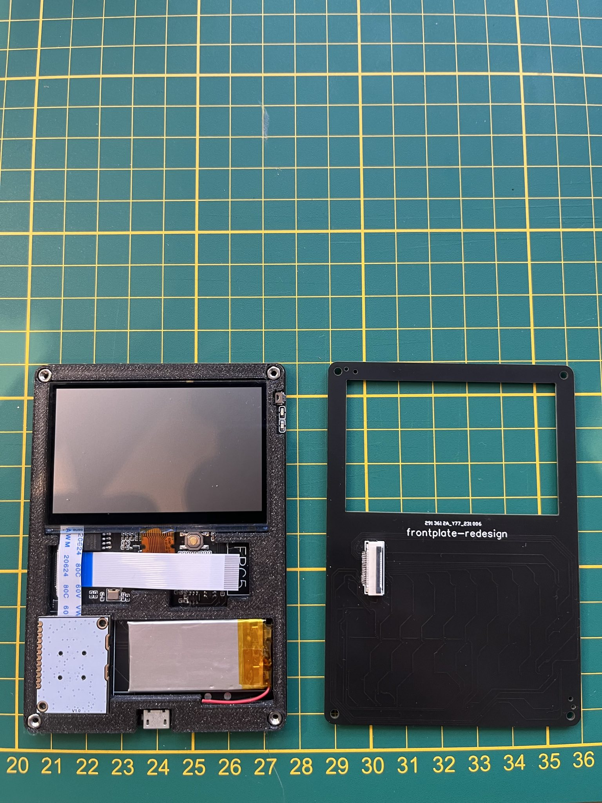
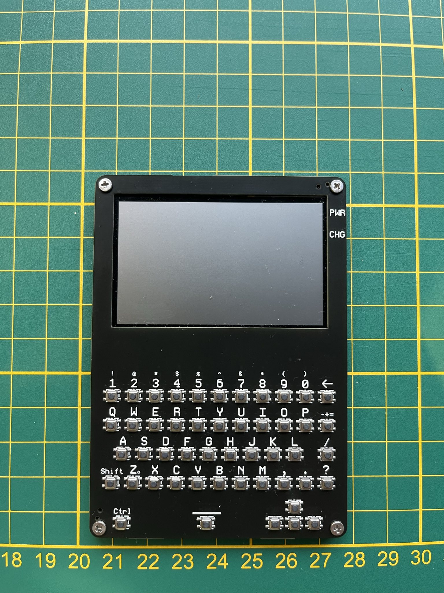

# qryptr
If your smartphone is compromised, cryptographic measures will not help you. An adversary will simply read messages from your keyboard or screen. Most cryptography today secures data in-transit.

We introduce an offline device that contains cryptographic keys, a keyboard, a camera and a screen. Text messages are encrypted with ECC and displayed as QR codes which can be shared using your smartphone. Because encryption and decryption is done on a seperate device, cryptographic keys cannot be compromised. Plaintext is only written and displayed on a seperate device.

This repository contains all hardware and software to create such a handheld device, which allows text messages of up to 299 characters.

# architecture

Each user has a single handheld device.

Upon receiving the device, the user can generate his/her ECC keypair, her CryptoID.

The public key of the Crypto ID can be displayed onscreen as a QR code. Another user can add that CryptoID by scanning it. This is preferably done in-person.

After adding each others' keys, users can write messages which are encrypted, encoded and displayed as QR codes.

Using their smartphones, the users can photograph/share these QR-codes, which contains the encrypted messages, with their preferred messaging app, such as Signal or Whatsapp.

The receiving user can select the sender, scan the shared photograph with his/her qryptr device, which will read, decode, decrypt and display the text message.

# use cases
-Sharing passwords between system administrators, or for HSM procedures.

-Sharing sensitive information between people.

# implementation
## hardware
We chose a microcontroller platform to minimize platform complexity: the RP2040.

QR codes are read using a hardware camera, the GM-803. 

We are using the Sharp LS027B7DH01 display. 

Hardware designs are available in the /hardware folder. These can be used to improve the design or to order the hardware on jlcpcb.com directly.
Alternatively, you can view these at the following urls:
https://oshwlab.com/thomas255/mainplate-public
https://oshwlab.com/thomas255/frontplate-public

Some parts needs to be ordered seperately from lscs.com
-LCSC#: C2911889 Clamshell 18P Bottom Contact Surface Mount FFC connector. We used one sided assembly at JLCPCB to save costs. This part can be soldered manually, or alternatively, two sided assembly can be used at JLCPCB, in which case this part does not need to be ordered seperately.

-LCSC#: C2857713 18P Opposite Side 5cm P=0.5mm flat flexible cable to connect the frontplate (keyboard) with the mainplate

-LCSC#: C5151979 12P Opposite Side 5cm P=0.5mm flat flexible cable to connect the GM-803 camera to the mainplate

You also need M2 nuts and M2 bolts of 3mm length to complete the assembly

A spacer.stl file is provided for 3d printing, this acts as a spacer for mechanical stability.

## software
We use the Arduino IDE.

Go to the board manager and install Arduino mbed OS RP2040 Boards (3.5.4)
this should set target_platform=mbed_rp2040 in preferences.txt for the arduino IDE

We use the Arduino mbed_rp2040 target platform, because we want to use the Sharp LS027B7DH01 display, and the earle philhower core does not allow changing the HW SPI pin assignment. We want to use different pins for driving the SPI display in the u8g2 display constructor, because the original pin assignment is very slow.

Using the library manager in the Arduino IDE, install the following libraries:
-QRCode by Richard Moore (https://github.com/ricmoo/qrcode/)
-U8G2 by Oliver Kraus (https://github.com/olikraus/u8g2)
-Crypto by Rhys Weatherley and Brandon Wiley (https://github.com/OperatorFoundation/Crypto)

# todos
## hardware
-Add resistor divider to measure the battery voltage
## software
-Create a software procedure to turn the camera on/off to save power.
-Implement soft poweroff after timeout.
-Implement symmetric encryption on the long-term private key of the user. This will require a password prompt for decoding messages.
-Enable multiple personal ID's (cryptographic keys)
-Add start and end tags for messages and keys, so that it is clear whether a valid messages/key was received.
-Use camera without character encoding (raw bytes).
-Write special characters with ctrl button.
-On screen arrows to make navigation more intuitive.

# FAQ
## hardware
Q: Could we run the whole device on 3.3V? 

A: The Sharp LS027B7DH01 display requires 5V according to the specifications, although it seems to work on 3.3V as well. Possibly, the charge boost circuit could be left out if the display is used at 3.3V.

Q: Could we create a single PCB instead of a backplate and frontplate?

A: Yes, it could be done, although a singular PCB would need double-sided PCB assembly, which is more expensive for small quantities @ JLCPCB. Also, a seperate backplate would need to be introduced.

Q: How about using an epaper display instead of the Sharp display?

A: It has been considered, but the Sharp display has a higher refresh rate and more pixels, since we need quite large QR codes to get to 240 character messages. The Sharp display still has low energy consumption. It is also very flat and easy to integrate with just a couple of capacitors. The Sharp display is easy to use with the U8G2 library.

## software

# How to construct

