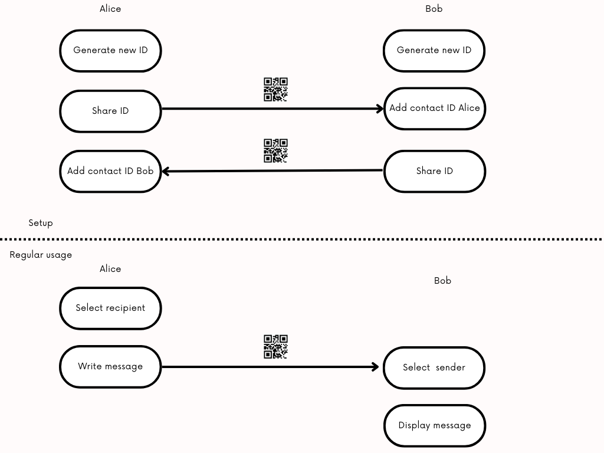

# qryptr
Applied cryptography can be complex and vulnerable. Side-channel attacks, spyware, and the complex ecosystem of smartphones hurts security of users.

We introduce a seperate, offline device that contains cryptographic keys, a keyboard, a camera and a screen. Encrypted messages are shared as QR codes using regular smartphones.

In case the smartphone is compromised, the security of the shared messages is not affected.

This repository contains all hardware and software to create a handheld device (the "qryptr") that secures text messages of up to 260 characters.

# architecture

Each user has a single handheld qryptr device.

Upon receiving the device, the user can generate his/her ECC keypair, her CryptoID.

The public key of the Crypto ID can be displayed onscreen as a QR code. Another user can add that CryptoID by scanning it. This is preferably done in-person.

After adding keys, users can write messages which are encrypted (AEAD), encoded and displayed as QR codes.

Using their smartphones, the users can photograph/share these QR-encoded, encrypted messages over their preferred messaging app, such as Signal or Whatsapp.

The receiving user can scan the shared photograph with his/her qryptr device. After selecting the recipient, the device will read, decode, decrypt and display the text message.

# use cases
-Sharing passwords between system administrators.

-Sharing passwords for HSM procedures.

-Sharing passwords for crypto wallets.

-Sharing sensitive information between people.

# implementation
## hardware
We chose a microcontroller platform to minimize platform complexity: the RP2040.

QR codes are read using a hardware camera, the GM-803. 

We are using the Sharp LS027B7DH01 display. 

Hardware designs are available in the /hardware folder. These can be used to improve the design or to order the hardware on jlcpcb.com. 

Some parts needs to be ordered seperately from lscs.com
-LCSC#: C2911889 Clamshell 18P Bottom Contact Surface Mount FFC connector. We used one sided assembly at JLCPCB to save costs. This part can be soldered manually, or alternatively, two sided assembly can be used at JLCPCB, in which case this part does not need to be ordered seperately.

-LCSC#: C2857713 18P Opposite Side 5cm P=0.5mm flat flexible cable to connect the frontplate (keyboard) with the mainplate

-LCSC#: C5151979 12P Opposite Side 5cm P=0.5mm flat flexible cable to connect the GM-803 camera to the mainplate

You also need M2 nuts and M2 bolts of 3mm length to complete the assembly

A spacer.stl file is provided for 3d printing, this acts as a spacer for mechanical stability.

## software
We use the Arduino IDE.

Go to the board manager and install Arduino mbed OS RP2040 Boards (3.5.4)
this should set target_platform=mbed_rp2040 in preferences.txt for the arduino IDE

We use the Arduino mbed_rp2040 target platform, because we want to use the Sharp LS027B7DH01 display, and the earle philhower core does not allow changing the HW SPI pin assignment. We want to use different pins for driving the SPI display in the u8g2 display constructor, because the original pin assignment is very slow.

Using the library manager in the Arduino IDE, install the following libraries:
-QRCode by Richard Moore (https://github.com/ricmoo/qrcode/)
-U8G2 by Oliver Kraus (https://github.com/olikraus/u8g2)
-Crypto by Rhys Weatherley and Brandon Wiley (https://github.com/OperatorFoundation/Crypto)

# todos
## hardware
-Add resistor divider to measure the battery voltage
## software
-Create a software procedure to initialize the camera

# FAQ
-

