# qryptr - airgapped ecc text messenger

Are you a smartphone user worried about [spyware](https://en.wikipedia.org/wiki/Spyware), [advanced actors](https://en.wikipedia.org/wiki/Advanced_persistent_threat), [backdoors](https://en.wikipedia.org/wiki/Backdoor_(computing)) or [side-channel attacks](https://en.wikipedia.org/wiki/Side-channel_attack)? These routinely bypass end-to-end encryption through keyloggers, screen capture and compromised keys. 

We introduce a simple offline, airgapped device to counter such threats. Plain text messages are ECC encrypted and displayed as QR codes. These QR codes can be photographed and shared using your smartphone. This method offers additional endpoint security.

This repository contains all hardware and software to create such a device, which allows text messages of up to 299 characters.

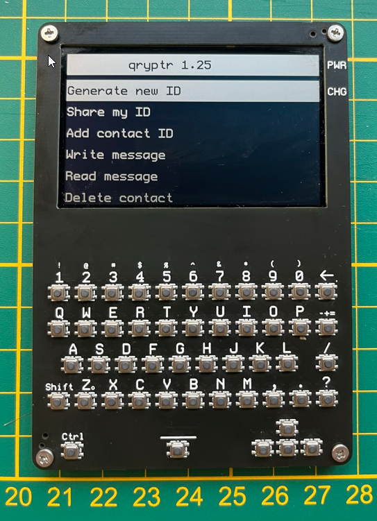

# How it works
The device has cryptographic software, a keyboard, camera, screen and is based on the RP2040 microcontroller.

Each user has a device. Upon receiving it, the user can generate his/her ECC keypair. The user's ECC keypair uniquely identifies him/her, that is why it is referred to as the user ID.

The public key of the user ID can be displayed as a QR code. Another user can add that user ID scanning it. This is preferably done in-person, not remotely, to prevent man-in-the-middle attacks. 

After two users have added each others' ID's, they can write text messages which are ECC encrypted, base64 encoded and displayed as QR codes.

Using their smartphones, users can photograph/share these QR-codes with their preferred messaging app, such as Signal, Whatsapp, Telegram, Viber, or even email or print the QR codes.

The recipient can scan the QR code with his/her device, which will read, decode, decrypt and display the text message. The recommended read distance is 10 cm between smartphone screen and camera. The letter "Z" is marked on the frontpanel to help a user center the qr code in front of the camera.

### Share and add IDs

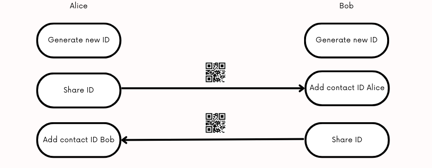

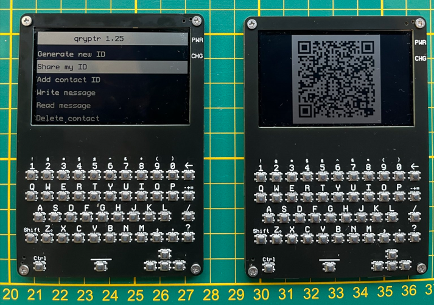

### Write and read messages

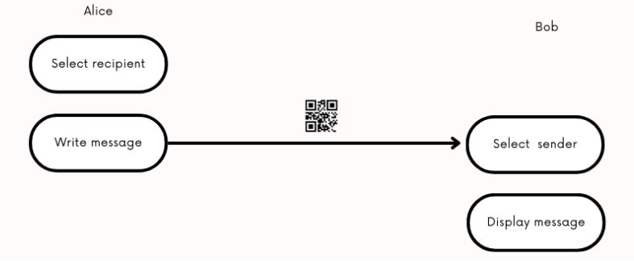

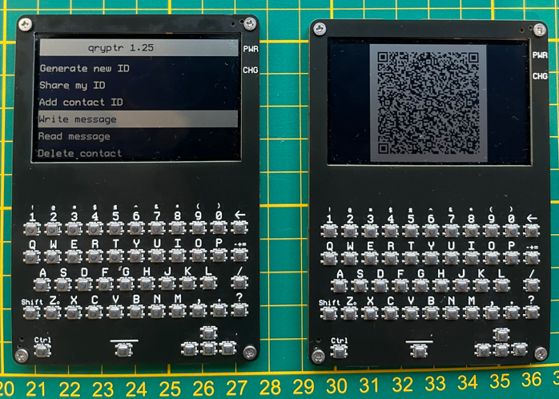

# Use cases
-Sharing passwords between system administrators.

-Sharing passwords for crypto wallets.

-Sharing key material or passwords for HSM procedures.

-Sharing sensitive information.

-Thwart spyware or advanced threats.

# Implementation
## hardware
The device consists of 2 printed circuit boards (PCBs): a mainplate and frontplate with keys.

We chose a microcontroller platform to minimize platform complexity and dependencies: the RP2040.

QR codes are read using a hardware camera, the GM803, available on aliexpress. Get the GM803-S version with short focal range. This camera will read the QR code towards the serial interface of the RP2040.

We are using the Sharp LS027B7DH01 display, available on aliexpress. It is flat, requires few components, has a high resolution and low power requirements. Other u8g2 supported displays could be used as well wih some adjustments.

Hardware designs are available in the /hardware folder. With the Gerber, BOM and pick-and-place files, you can order directly from jlcpcb.com.

Alternatively, you can view or clone these at the following urls to make adjustments.

https://oshwlab.com/thomas255/mainplate-public (click "clone") 
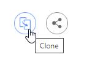
https://oshwlab.com/thomas255/frontplate-public (click "clone")

Some parts needs to be ordered seperately from lscs.com:

-LCSC#: C2911889 Clamshell 18P Bottom Contact Surface Mount FFC connector.

We used one sided assembly at JLCPCB to save costs. 
This part can be soldered manually, or alternatively, two sided assembly can be used at JLCPCB, in which case this part does not need to be ordered seperately.

-LCSC#: C2857713 18P Opposite Side 5cm P=0.5mm flat flexible cable to connect the frontplate (keyboard) with the mainplate

-LCSC#: C5151979 12P Opposite Side 5cm P=0.5mm flat flexible cable to connect the GM-803 camera to the mainplate

-M2 nuts and M2 bolts of 3mm length.

-A plastic spacer between the mainplate and frontplate, for mechanical stability and assembly, which can be 3d printed with the provided spacer.stl file.

-A 302040 lipo battery: https://www.aliexpress.com/item/33009055815.html

## software
We use the Arduino IDE.

Go to the board manager and install Arduino mbed OS RP2040 Boards (3.5.4). This should set target_platform=mbed_rp2040 in preferences.txt for the arduino IDE.

We use the Arduino mbed_rp2040 target platform, because we want to use the Sharp LS027B7DH01 display, and the earle philhower core does not allow changing the HW SPI pin assignment. We want to use different pins for driving the SPI display in the u8g2 display constructor, because the original pin assignment is very slow.

Using the library manager in the Arduino IDE, install the following libraries:

-QRCode by Richard Moore (https://github.com/ricmoo/qrcode/)

-U8G2 by Oliver Kraus (https://github.com/olikraus/u8g2)

-Crypto by Rhys Weatherley and Brandon Wiley (https://github.com/OperatorFoundation/Crypto)

To upload the software, connect with PC through USB, turn on device, upload ./software/qryptr.ino through the arduino IDE. If that does not work, there is a reset button. Turn off the device, hold the reset button, connect with PC, release the reset button. Then upload the arduino sketch through the arduino IDE.

Once uploaded, navigate the menu with the arrow buttons (left, right, up, down). There is no enter key. To select an option, use the right arrow. You can always go back with left arrow or interrupt reading by pressing any key.

# Todos
## hardware
-Add resistor divider to measure the battery voltage

-Expose SWD pins on PCB to enable loading the software through SWD pins. This will allow us to disconnect the datalines from the USB port and prevent an attack vector.

## software
-Create a software procedure to turn the camera on/off to save power.

-Implement soft poweroff after timeout.

-Implement symmetric encryption on the long-term private key of the user. This will require a password prompt for decrypting messages.

-Enable multiple personal ID's (cryptographic keys)

-Add start and end tags for messages and keys, so that it is clear whether a valid messages/key was received. This will prevent bad reads from crashing the device as well.

-Use camera without character encoding (raw bytes).

-Write special characters (diacritics) with ctrl button.

-On screen arrows to make navigation more intuitive.

# FAQ
## hardware
Q: Could we run the whole device on 3.3V? 

A: The Sharp LS027B7DH01 display requires 5V according to the specifications, although it seems to work on 3.3V as well. Possibly, the charge boost circuit could be left out if the display is used at 3.3V.

Q: Could we create a single PCB instead of a backplate and frontplate?

A: Yes, it could be done, although a singular PCB would need double-sided PCB assembly, which is more expensive for small quantities @ JLCPCB. Also, a seperate backplate would need to be introduced.

Q: How about using an epaper display instead of the Sharp display?

A: It has been considered, but the Sharp display has a higher refresh rate and more pixels, since we need quite large QR codes to get to 299 character messages. The Sharp display still has low energy consumption. It is also very flat and easy to integrate with just a couple of capacitors. The Sharp display is easy to use with the U8G2 library.

## software
Q: How is encryption done?

A: Using the arduino Crypto library, with 32 byte ECC curve25519 keys, using ChaChaPoly cipher. Documented in the code, according to the procedure described here:

https://crypto.stackexchange.com/questions/101420/eccdh-direct-or-with-temporary-ecc-keypairs

# Construction
Place the battery and solder the wires as shown below to the pads.

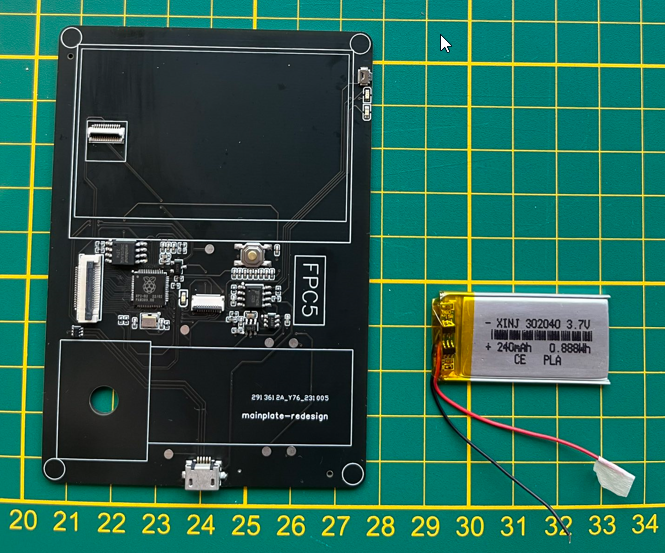

Place the 3d printed spacer as shown below, insert the m2 nuts with some glue.

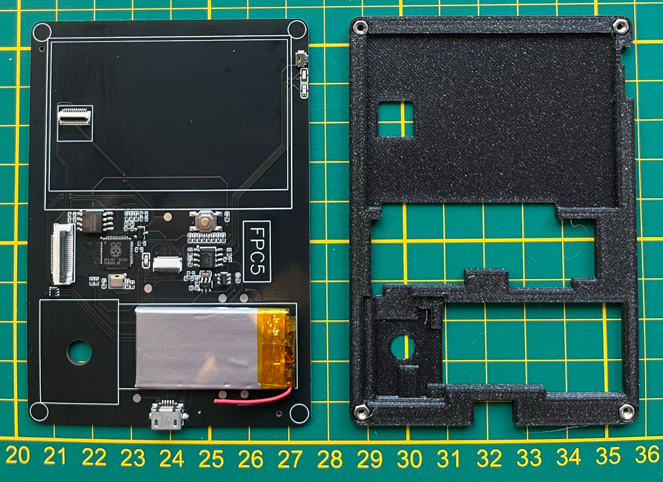

Connect the 18 pin keyboard connector as shown below, place the GM-803 camera module and connect with the 12 pin ffc connector cable.

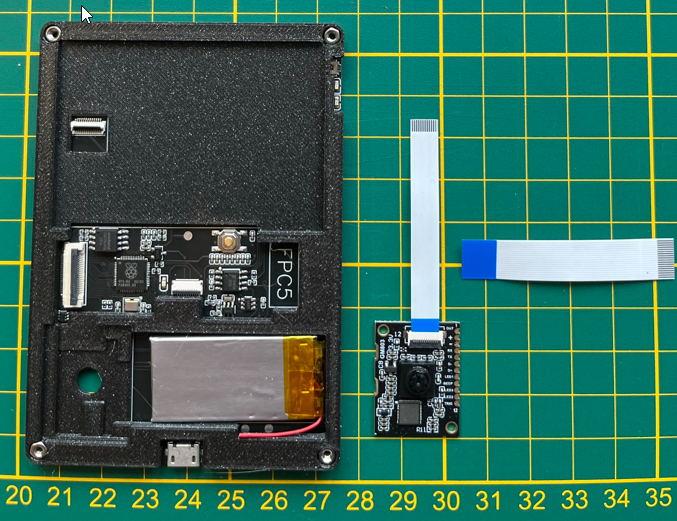

Place the screen as shown below.

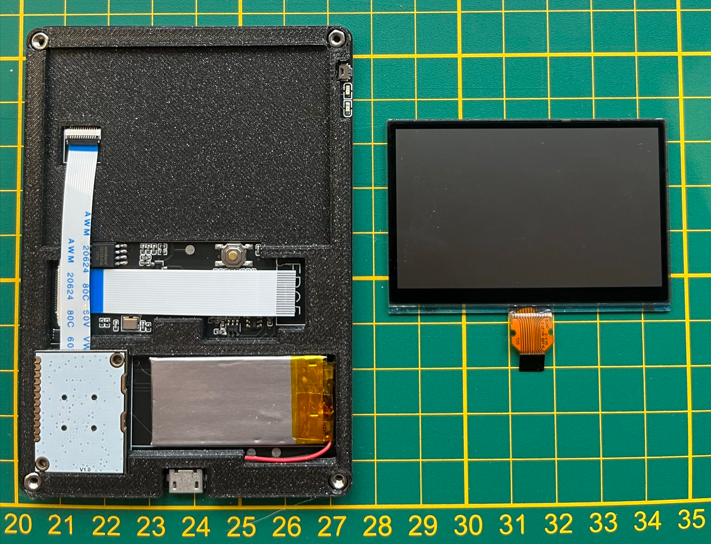

Solder the frontplate 18 pin connector (or order an assembled frontplate from JLCPCB), and connect it. Soldering this 0.5mm pitch connector can be a bit tricky.

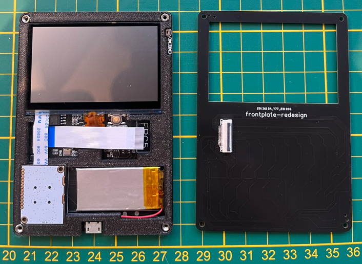

Use the m2 3mm bolts to screw the frontplate down.

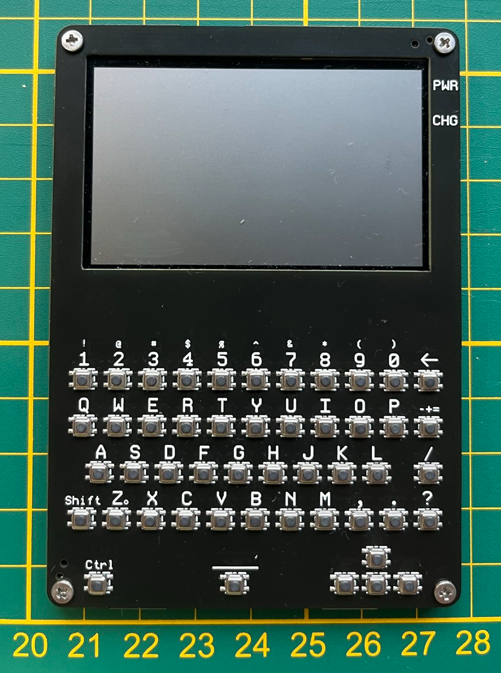

